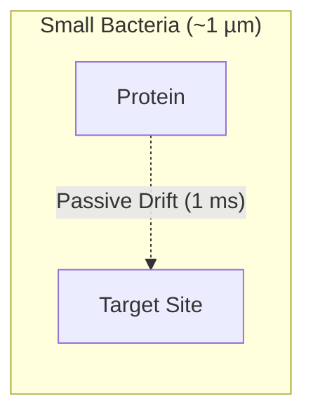
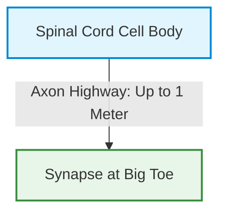
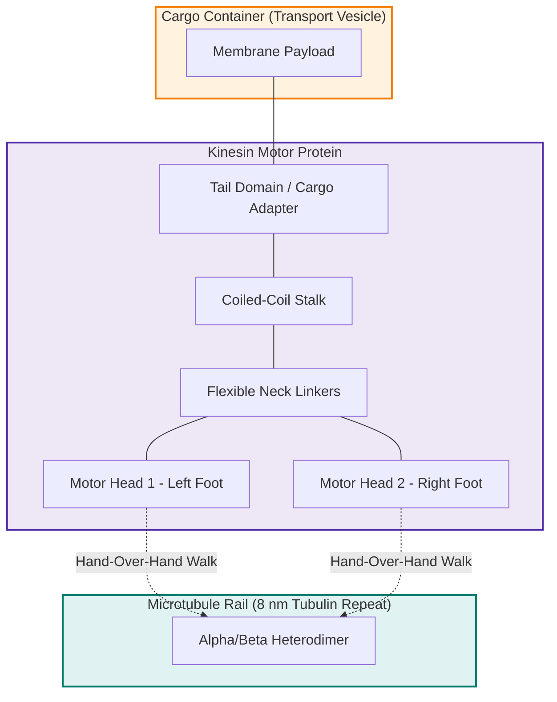
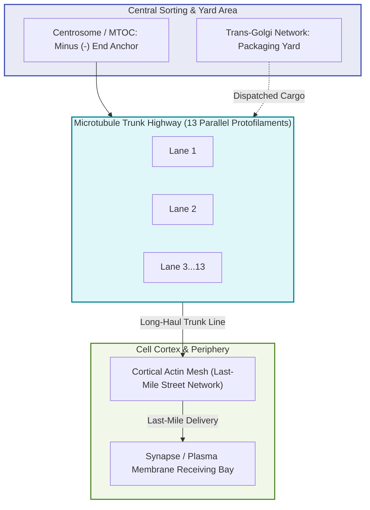
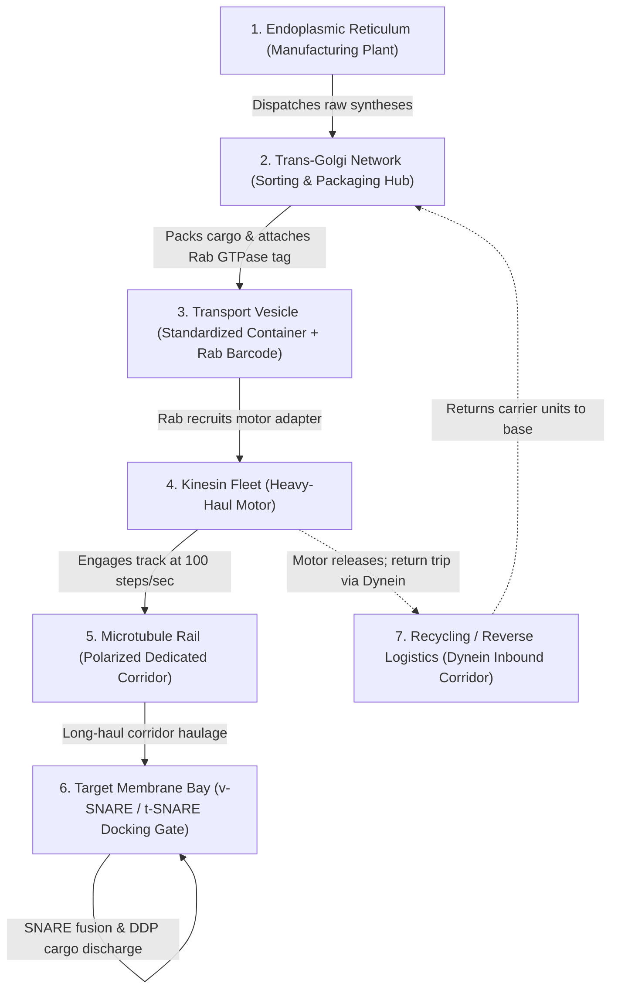
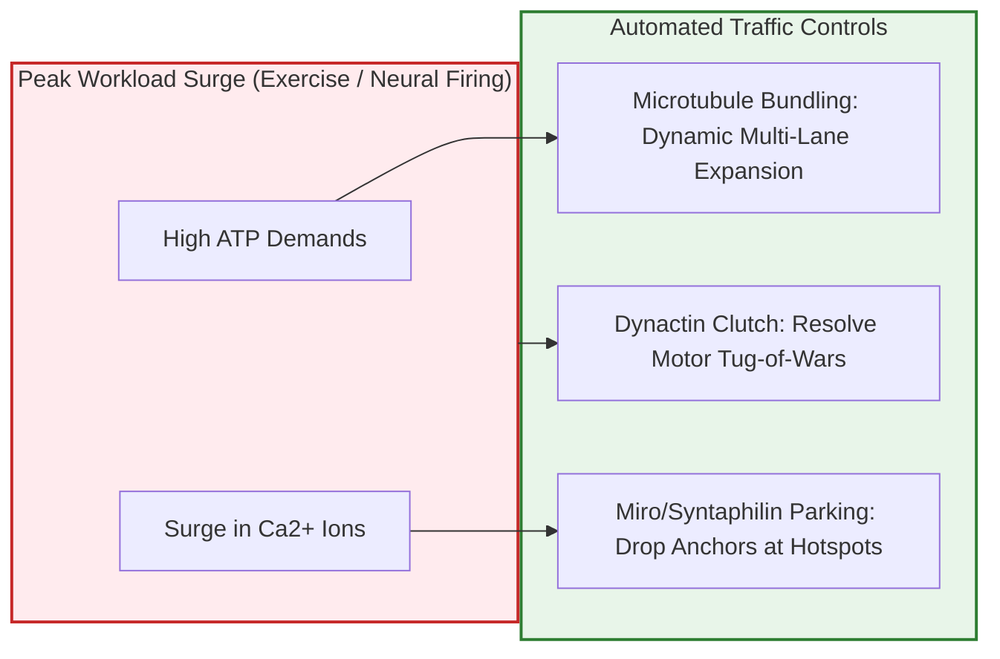

# The Invisible Logistics Empire Inside You: Why Nature Beat Modern Supply Chains Two Billion Years Ago

Look at your hand for five seconds. In that brief window, millions of heavy-duty freight carriers inside your cells just completed long-haul deliveries, switched multi-lane express tracks, parked living power plants directly into emergency power bays, and burned through millions of high-energy fuel packets without causing a single traffic jam.

No human supply chain on Earth—neither Amazon’s fulfillment centers, nor Maersk’s global container fleets, nor the world’s longest Dedicated Freight Corridors—operates with this degree of zero-waste precision.

Centuries before industrial engineers formalized Lean Manufacturing, Six Sigma defect rejection, or Just-in-Time (JIT) dispatching, single-celled life solved the hardest logistical nightmare in the known universe: **the physics of moving massive cargo through liquid concrete.**

Welcome to the cellular Supply and Dispatch (S&D) department. Your fleet’s heavy hauler is named **Kinesin**, and it literally walks.

---

## 1. The Physics Bottleneck: Why Diffusion Was an Operational Death Sentence

To appreciate why your body built an automated freight railway, you first have to understand what happens when logistics relies on passive drift.

In the microscopic realm of simple bacteria, a cell is barely one micrometer across. If a protein needs to travel from one side of a bacterium to the other, it relies on **passive Brownian diffusion**—random thermal jiggling. In a space that small, a molecule bounces across the room in a fraction of a millisecond. No engines required.

Then, roughly two billion years ago, life made an evolutionary leap: **eukaryotes** emerged. Cells developed internal compartments, specialized organelles, and grew hundreds to thousands of times larger. 

Here, physics presented a lethal catch. In thermodynamics, diffusion time does not scale in a straight line with distance. It scales with the **square of the distance**:


$$t = \frac{{x^2}}{2D}$$


If a cell becomes 10 times larger, diffusion takes **100 times longer**. If it becomes 1,000 times larger, diffusion takes **1,000,000 times longer**.

Now consider a human motor neuron. Its central command center (the soma) sits in your lower spinal cord, while its delivery terminal terminates at the tip of your big toe. That single cellular extension—the axon—can measure over **one meter** in length.

If a vital vesicle containing neurotransmitters had to float down that one-meter corridor by random diffusion through the dense, gelatinous cytoplasm, mathematical modeling reveals a terrifying number: **it would take several thousand years to arrive.** 

The nerve terminal would starve, collapse, and die long before the first delivery cleared the door.

To build complex life, evolution had no choice: it had to lay down rails, build motorized rolling stock, and launch a dedicated logistics division.

---

## 2. Meet the Fleet: A Truck Named Kinesin

Imagine standing inside a cavernous warehouse. Across the floor stretch long, hollow steel pipes. Straddling one of these pipes is a two-legged mechanical engine. Suspended from its neck is a spherical container hundreds of times its own size, loaded with pressurized biochemicals.

This is **Kinesin-1**, the heavy-duty prime mover of cellular logistics.

### Does It *Actually* Walk?
When molecular biologists first observed kinesin under high-resolution optical traps and cryo-electron microscopes, they assumed "walking" was a loose metaphor for chemical ratcheting.

It is not a metaphor. **Kinesin literally walks hand-over-hand, placing one foot in front of the other in an asymmetrical human-like gait.**

Here is how the engine cycles at the molecular level:

1. **The Docked Foot:** One catalytic head binds tightly to a tubulin protein on the track. In its pocket rests a spent fuel packet (ADP).
2. **Fuel Injection:** A fresh molecule of Adenosine Triphosphate (ATP)—the universal energy currency—enters the forward head.
3. **The Power Stroke:** ATP binding triggers an instantaneous mechanical snap called "neck-linker docking." Like an internal spring snapping shut, this lever action flings the trailing head forward through the water by **16 nanometers**.
4. **Touchdown:** The swinging foot lands exactly **8 nanometers** ahead of its partner, finding the next identical tubulin docking station on the rail.
5. **Hydrolysis & Hand-off:** The rear head cleaves its ATP into ADP and inorganic phosphate, releasing its tight grip. Now the roles reverse: the rear foot becomes ready to swing, and the forward foot prepares to burn the next ATP.

Each single step covers **8 nanometers**, matching the structural repeat of tubulin proteins with zero deviation. A single kinesin motor sprints at roughly **80 to 100 steps per second**, generating **5 to 7 piconewtons** of stall force. Relative to its molecular mass, that power-to-weight ratio allows it to haul massive membrane spheres through viscous fluids that would feel like wet cement to human machinery.

---

## 3. The Dedicated Freight Corridor: Anatomy of the Tracks

A high-performance freight truck is useless without a dedicated permanent way. The cell does not allow its haulers to wander aimlessly; it forces them onto rigid, polarized tubular highways called **microtubules**.

### The Universal Gauge
Human railroads spent decades suffering from conflicting track gauges—broad gauge, standard gauge, narrow gauge—preventing seamless transitions across borders. Evolution standardized track geometry two billion years ago:

* Every microtubule is a hollow cylinder formed by **13 parallel protofilaments** aligned side-by-side.
* The outer diameter is strictly **25 nanometers**.
* The repeating stepping blocks ($ lpha$- and $ eta$-tubulin heterodimers) form an identical 8-nanometer periodicity across virtually every animal, plant, and fungal cell on Earth.

### Built-in Directional Polarity
Microtubule tracks possess intrinsic chemical directionality. One end is designated the **minus (–) end**, securely anchored at the cell’s central train yard near the nucleus: the **Centrosome** (Microtubule Organizing Center, or MTOC). 

The opposite end is the **plus (+) end**, extending outward toward the cell perimeter and terminal branches.

This structural polarity enforces strict traffic separation:
* **Kinesin** is the **outbound freight line (anterograde dispatch)**: its structural architecture mechanically biases its steps exclusively toward the **plus (+) end**.
* **Dynein** is the **reverse logistics / salvage fleet (retrograde dispatch)**: it hauls spent containers, damaged organelles, and environmental signals back toward the **minus (–) end** for recycling.

Because directional priority is baked into the physics of the motors, outbound and inbound freights never suffer head-on locomotive collisions on the same protofilament track.

---

## 4. The Complete S&D Operation: From Order Entry to Docking

How does a cellular shipping operation run from scratch? Walk through a complete dispatch lifecycle:

### Step 1: Manufacturing at the Plant (Endoplasmic Reticulum)
Raw materials—structural proteins, metabolic enzymes, peptide hormones—are manufactured continuously along the membranes of the Endoplasmic Reticulum (ER).

### Step 2: Sorting, Tagging, and Packaging (The Trans-Golgi Network)
From the ER, raw items move to the **Trans-Golgi Network (TGN)**. The Golgi is the cell’s central intermodal container yard:
* It sorts items by chemical identity.
* It encloses the cargo inside standard phospholipid lipid-bilayer vesicles (the molecular equivalent of ISO standard shipping containers).
* It stamps the container surface with a specific chemical barcode: a **Rab GTPase**.

### Step 3: Dispatch & Carrier Booking (The Waybill)
There are dozens of different Rab proteins (Rab3, Rab5, Rab11, etc.). Each Rab code represents a non-negotiable delivery address. When a vesicle is stamped with a peripheral address tag, that specific Rab protein directly recruits a **Kinesin** motor and binds it to the container's tail. The contract is executed; the hauler is hitched.

### Step 4: Long-Haul Transit (The Freight Run)
Kinesin latches its dual motor heads onto a nearby microtubule protofilament. Burning one ATP per step, it accelerates into its cadence, sprinting down the axon corridor at roughly one micrometer per second. If the track hits minor obstacles, multi-motor teams coordinate to pivot around the cylinder circumference across the 13 available lanes.

### Step 5: Pure Delivered Duty Paid (No EXIM Friction)
In macroscopic cross-border trade, cargo sits idle at container freight stations awaiting Export-Import (EXIM) clearances, customs bills, inspection waivers, and tax reconciliation.

The cellular S&D department operates on pure **Delivered Duty Paid (DDP)** terms:
* There are no third-party freight forwarders.
* When the vesicle arrives at the target membrane dock, it displays a specialized surface key: a **v-SNARE** (vesicular SNARE protein).
* The dock displays complementary locks: **t-SNAREs** (target SNAREs).
* The instant v-SNARE twists into t-SNARE, a four-helix coiled coil zips together with extreme mechanical force. 
* This physical leverage squeezes the vesicle against the target membrane so tightly that water is displaced, the membranes fuse, and the cargo discharges directly into the receiving bay in milliseconds.

Zero demurrage charges. Zero warehouse holding waste. Delivery complete.

---

## 5. What Happens During Peak Rush Hour?

An obvious question arises: What happens when the body works hard—during intense athletic exertion or deep cognitive problem-solving? Wouldn't dispatch volume spike and cause catastrophic traffic jams?

Modern highway systems choke under high volume. But the cellular corridor deploys three automated protocols that keep transit completely fluid:

1. **Multi-Lane Express Expansion:** Under prolonged operational stress, cells rapidly signal microtubule-associated organizing centers to polymerize additional parallel tracks. By bundling micro-rails together, the cell converts a single trunk route into a four-lane or eight-lane expressway in real time.
2. **Automated Generator Parking (The Miro/Syntaphilin System):** The heaviest freight items traveling these tracks are **mitochondria**—the 1-micrometer-long cellular power plants. Having dozens of massive power plants moving during peak congestion would block smaller freight. Evolution solved this with a local parking sensor:
   * Where metabolic activity is highest, local calcium ($	ext{Ca}^{2+}$) concentration surges.
   * Calcium binds directly to **Miro**, an outer sensor on the mitochondrion.
   * Kinesin is instantly commanded to drop the throttle, while an anchor protein named **Syntaphilin** grabs the track like an emergency brake.
   * The power plant pulls off the throughway and docks right at the spot of highest fuel depletion, generating local ATP without clogging arterial traffic.
3. **The 13-Lane Bypass:** Because a single microtubule tube features 13 parallel protofilaments, passing slower freight does not require halting traffic. Motor complexes can sidestep onto adjacent protofilaments or hand off cargo across overlapping filaments.

---

## 6. The Grand Blueprint: Lessons for Human Economies

When operations research specialists look at the cell, they are not looking at squishy biology—they are looking at an optimization engine refined over two billion years of relentless natural selection. Any cell lineage that wasted fuel, maintained bloated warehouses, or allowed supply chains to gridlock went extinct.

| Industrial Logistics Principle | Human Infrastructure | The Cellular Benchmark |
| :--- | :--- | :--- |
| **Dedicated Trunk Routes** | Dedicated Freight Corridors (DFC) | **Microtubules:** Rigid, polarized rails isolated from passive cytoplasmic clutter. |
| **Prime Mover Fleet** | Electric Heavy-Haul Locomotives | **Kinesin Superfamily (45 KIF genes):** Dedicated motors specialized for distinct freight types. |
| **Standardized Containers** | ISO Intermodal Shipping Containers | **Phospholipid Vesicles:** Uniform membrane packaging compatible with all docks. |
| **Automated Routing Tags** | Barcode Labels & RFID Waybills | **Rab GTPases:** Destination tags that recruit specific motors and guide docking. |
| **Gate-Pass Verification** | Automated RFID Terminal Gates | **SNARE Complexes:** Physical molecular interlocks permitting instant delivery fusion. |
| **Last-Mile Multimodal Transfer** | Rail-to-Truck Logistics Hubs | **Microtubule-to-Actin Handoff:** Kinesin passes cargo to Myosin at cell margins. |
| **Circular Recycling** | Reverse Logistics Scrap Depots | **Dynein & Lysosomal Autophagy:** Return transport of spent units disassembled into base monomers. |

Whenever human engineers build automated guided vehicles (AGVs) in dark fulfillment centers, implement JIT delivery to wipe out intermediate storage bins, or lay twin-track freight lines to bypass congested passenger nodes, they are not inventing a new paradigm.

They are quietly, meticulously rebuilding the mechanical masterpiece that has been running, uninterrupted, inside every single cell of their own bodies for two billion years.

The next time you take a step, pause and remember: beneath the surface, trillions of tiny molecular haulers just clocked another hundred steps on the rails, keeping the world’s most sophisticated economy moving.
